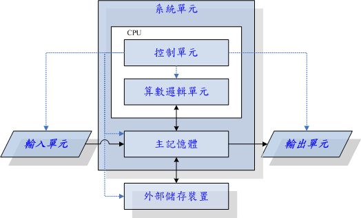
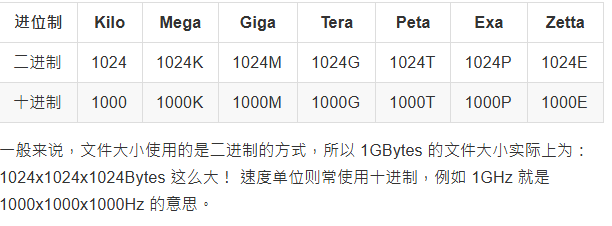
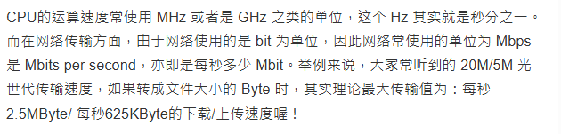
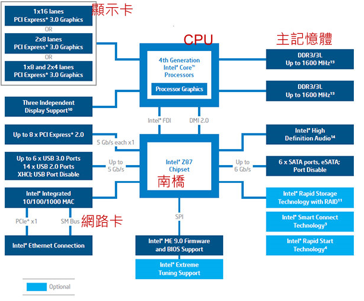
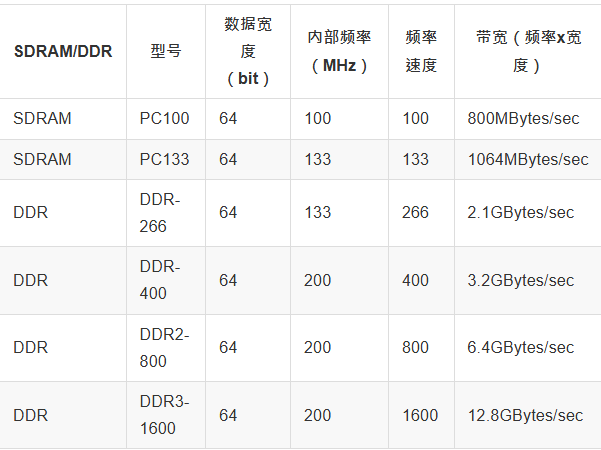
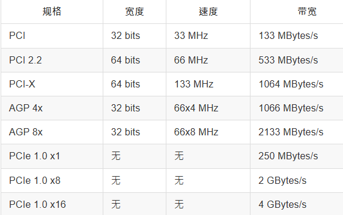
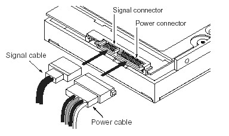
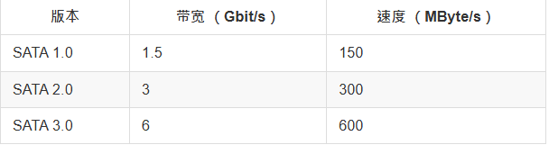
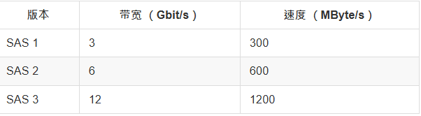

# 计算机的硬件

#### 输入单元：
- 键盘、鼠标、读卡机、扫描仪等等
#### 主机部分：
- 系统单元，板子，CPU与内存等等
#### 输出单元：
- 屏幕，打印机

#### 运作原理:
    CPU 读取的数据都是从内存来的，内存内的数据则是从输入单元所传输进来！
    而CPU处理完毕的数据也必须要先写回内存中，最后数据才从内存传输到输出单元。

#### 大致结构图：

#### CPU:
##### 分成两种架构：
- **RISC**(Reduced Instruction Set Computer, RISC)精简指令集
    - 学术领域大型工作站
    - 微指令集较为精简，每个指令的执行时间都很短，完成的动作也很单纯，指令的执行性能较佳；
    - 常见的 RISC 微指令集 CPU 主要例如甲骨文 （Oracle） 公司的 SPARC 系列、 IBM 公司的 Power Architecture （包括 PowerPC） 系列、与安谋公司 （ARM Holdings） 的 ARM CPU 
- **CISC**(Complex Instruction Set Computer)复杂指令集
    - 个人PC
    - 常见的CISC微指令集CPU主要有AMD、Intel、VIA等的x86架构的CPU
    - 位指是CPU一次数据读取的最大量，64位指的是CPU一次可以读取64bits
      
#### 计量单位
- 容量单位：

- 速度单位：

#### 电脑架构和相关设备元件

- CPU:
    - 外频：CPU与外部元件进行数据传输时的速度
    - 内频：CPU内部实际运作的频率
    - 倍频：CPU内部用来加速工作性能的一个倍数
    - 内频 = 外频 x 倍频系数

- 内存:

- 显卡:

bandwidth = width x frequency

- 硬盘和储存设备：
    - 最小单位：sector(512Byte)，现在有更大比如4KByte
    - 传输接口：
        -SATA接口：
        
        
        - SAS接口：
        
    - 硬盘区别：
        - 固态硬盘(SSD, Solid State Disk)
        - 传统硬盘(HDD, Hard Disk Drive)
    
- **CMOS与BIOS**：
>CMOS主要的功能为记录主板上面的重要参数， 包括系统时间、CPU电压与频率、各项设备的I/O位址与IRQ等，由于这些数据的记录要花费电力，因此主板上面才有电池。 BIOS为写入到主板上某一块 flash 或 EEPROM 的程序，他可以在开机的时候执行，以载入CMOS当中的参数， 并尝试调用储存设备中的开机程序，进一步进入操作系统当中。BIOS程序也可以修改CMOS中的数据， 每种主板调用BIOS设置程序的按键都不同，一般台式机常见的是使用[del]按键进入BIOS设置画面。

