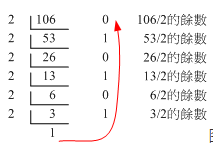
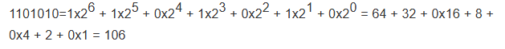
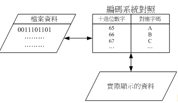

# 数据表达方式

#### 数字系统
十进制转换成二进制：

二进制转化成十进制：

#### 文字编码系统

- **原理**：
写入文字的文字数据，文字数据会由编码对照表将文字转化成数字，再存到文件当中。

- **文字系统**：
    - 常用的英文编码表为ASCII系统，每个符号，英语、数字或者符号都会占用1Bytes的记录。
    - 为了解决对照表写入还不成问题，读写时变成乱码，国际组织ISO/IEC制定出Unicode编码系统，UTF8(万国码)
