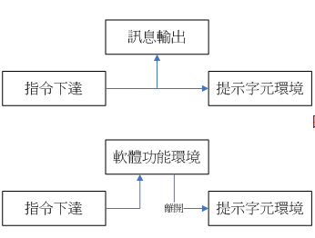
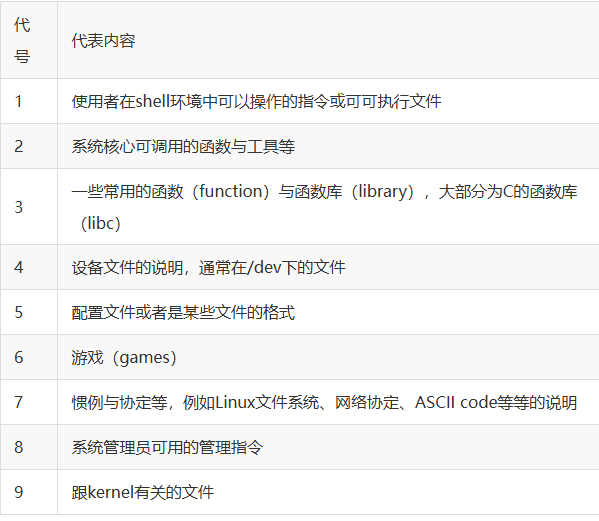
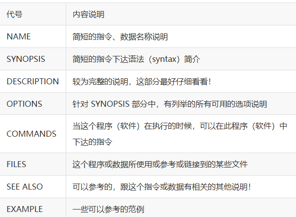
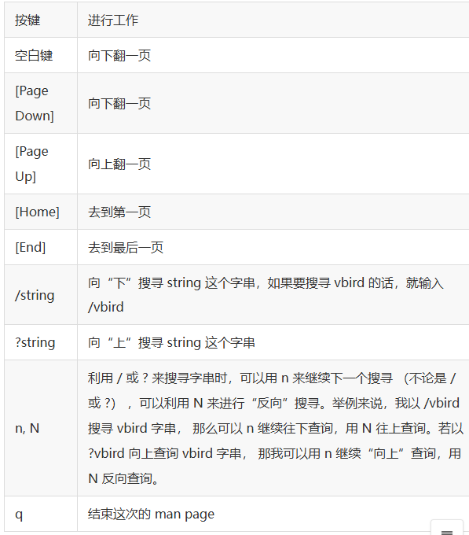
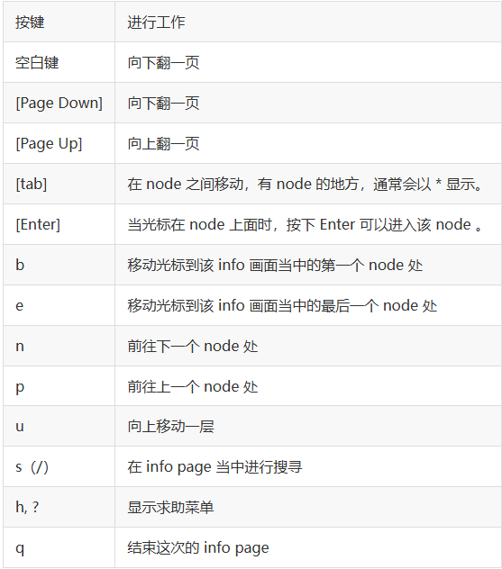

#### 指令
- 一种是该指令会直接显示结果
- 一种是进入到该指令的环境

#### 常见的热键
- __Tab__
自动补全命令
- __ctrl-c__
终止指令
- __ctrl-d__
等同于exit
- __shift+pageup/pagedown__
在纯文本中，往前翻页往后翻页

#### man
- 用man查找文件/指令时，__第一行文件/指令旁边的数字__：

- __man的主要组成部分__：

- __man的常用按键__：

#### info
_通常支持info指令的文件默认存在/usr/share/info_
> 和man用途差不多，用来查询指令的用法或者是文件的格式。
__info常见按键__：

#### 有用的文件
- __usr/share/doc__:
大部分指令或者软件制作者，都会将说明文档存放到这里面