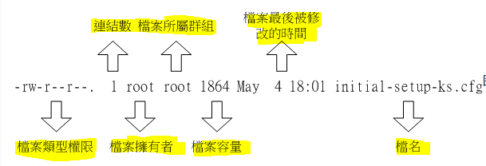
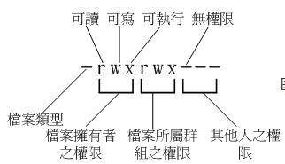
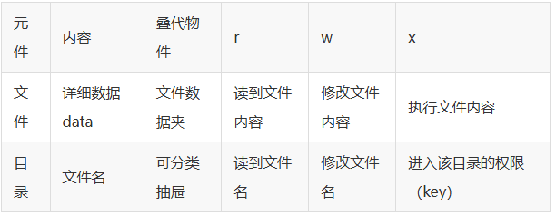

> - 所有系统上的**账号**与一般身份使用者，以及root的**信息**，都是存在 **/etc/passwd**文件中
> - **个人密码**则是记录在 **/etc/shadow**里面
> - Linux**群组信息**记录在 **/etc/group**

#### 1-文件属性
- 使用 __ls -al__
(**a**:列出隐藏文件， **l**：列出详细信息)：
查看后看到的结果，每一行对应的结果如下：

##### 文件属性

- 第一个字符：
    - [d] **目录**
    - [-] **文件**
    - [l] **链接文件**(link file)
    - [b] 设备文件中可提供储存的周边设备 **(可随机存取设备)**
    - [c] 设备文件中序列埠设备，例如**键盘、鼠标(一次性读取设备)**

- 第二个字符:
    - 【r】 **可读 4**
    - 【w】 **可写 2**
    - 【x】 **可执行 1**
    - 【-】 **无权限 0**
    > 前三位数字：文件拥有者可具备的权限
    中间三位数字：加入此群组的账号的权限
    后三位数字：非本人且没有加入本群组的其他账号的权限

##### 2-i-node
> 每个文件都会将他的权限与属性记录到文件系统中的i-node中

表示有多少文件名链接到此节点(i-node)

##### 3-owner
表达此文件/目录的拥有者账号

##### 4-group
表达此文件/目录的所属群组

##### 5-size
表达此文件/目录的容量大小，默认单位为Bytes

##### 6-date
表达这个文件/目录的创建日期或者最近修改日期
> 如果文件被修改的时间距离现在太久，则只会显示年份而不是具体时间，可以使用 **ls -l --full-time**就会显示具体时间

##### 7-filename
表达此文件/目录的名字
> 如果文件名前面有 多一个'.'，则表达这个是一个隐藏文件

#### 如何改变文件属性与权限
- **chgrp**: 改变文件所属群组
- **chown**: 改变文件拥有者(也可以同时更改group)
    - 也可以更改group：
    1. chown user:group filename
    2. chown :group filename
    3. 加上-R可以同时更改目录下所有的目录和文件
- **chmod**: 改变文件的权限, SUID, SGID, SBIT等等的特性
    - 数字类型更改权限：
    chmod 777 filename(give rwe permission to all)
    (**r:4, w:2 ,x:1**)
    - 符号类型更改权限：
    **u=user**, **g=group**, **o=others**, **a=all**
    *Example*:
    > give **user all permission**, **group** and **others** **read** and **exeucte** permission
    1. chmod u=rwx,go=rx filename
    > give **all** **write** permission
    2. chmod a+w filename
    > remove **all write** permission
    3. chmod a-x filename

*__overview__*：

#### 文件种类和拓展名
- **[-] 文件**：
    - ASCII(纯文本文件)
    - binary(二进制档)
    - data(数据格式文件)
- **[d] 目录**:
    > 就是目录。
- **[l] 链接文件(link)**:
    > 就是类型windows里面的捷径。
- **设备与设备文件(device)**：
    - **[b]** 区块(block)设备文件：
    1. 储存数据，比如硬盘和软盘
    2. 比如/dev/sda，属性就是[b]
    - **[c]** 字符(character)设备文件：
    1. 序列埠的周边设备，例如键盘、鼠标
    2. 一次性读取
    - **[s]** 数据接口文件(sockets)：
    1. 网络上的数据承接，启动一个程序来监听客户端的要求，用户端通过这个socket来进行数据沟通
    2. 通常在/run或者/tmp可以看到这个文件类型
    - **[p]** 数据输送档(FIFO, pipe):
    1. 解决多个程序同时存取一个文件造成的错问
    2. FIFO全程first-in-first-out

***Linux没有拓展名，一个文件是否能够被执行，是这个文件有没有x权限**
但还是会通过一些常见的拓展名表示这个文件的类型:
- **.sh**: 脚本或批处理文件 （scripts）
- **Z, .tar, .tar.gz, .zip, .tgz**: 经过打包的压缩文件
- **.html, .php**：网页相关文件
