#### 目录的相关操作

__特殊的目录__：


__cd用法例子__：


__pwd用法例子__：

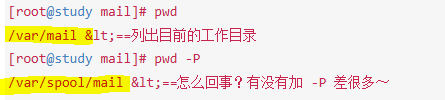

**pwd -P**：会显示一个**链接文件的正确完整路径**

__mkdir用法例子__：

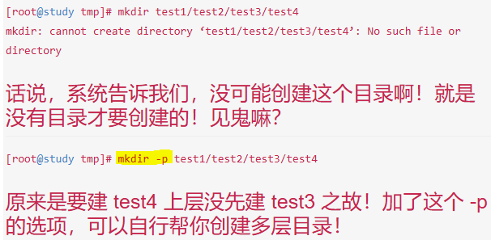

**mkdir -p**：会帮你自行创建多层不存在的目录


**mkdir -m**：会强制设置权限，否则会使用umask默认权限

__rmdir用法例子__：


**rmdir -P**：可以删除多个目录
> rmdir只能删除空的目录(empty directory)

#### 可执行文件路径的变量：$PATH

> 查看当前PATH(环境变量)： echo $PATH

1. 当你使用一个指令的时候，系统会依照PATH的设置去每个PATH定义的目录去搜索该指令的可执行文件
2. 不同身份使用者默认的PATH不同，默认能够执行的指令也不同
3. PATH是可以修改的
4. 可以使用绝对路径或相对路径指定某个指令的文件名来执行
5. 本目录(.)最好不要放到PATH当中

#### 文件与目录的检视
- __ls__ 常用选项：

    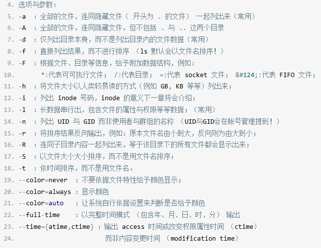

- __cp__ 常用选项：

    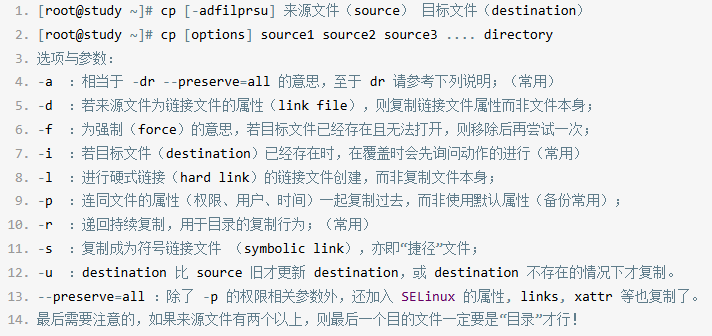
    
- __rm__ 常用选项：

    


> 取得路径的文件名： basename /etc/sysconfig/network
output: network


> 取得路径的目录名： dirname /etc/sysconfig/network
output: /etc/sysconfig


#### 文件内容查阅
- **cat(concatenate)**：


- **tac(反向cat)**

- **nl(添加行号打印)**：


实际例子：

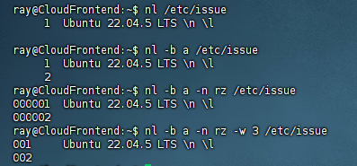

**less(一页一页翻动)**：

常用方法：

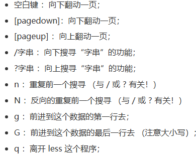

> man page其实就是调用了less指令来说明文档

**head(取出前面几行)**：

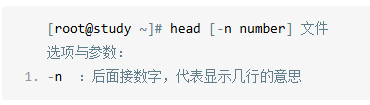

> 默认是显示10行，如果参数是'-n -100'，则表明不包含最后的100行

**tail(取出后面几行)**：

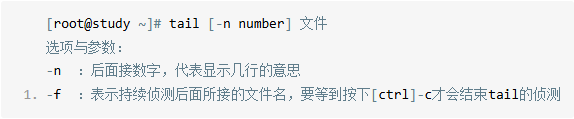

> 默认显示是后面十行，如果参数是'-n +100'，则表明不报行开头的100行

**管道'|'的用法**：
> 比如我需要显示/etc/man的第11到第20行

```Shell
head -n 20 /etc/man | tail -n 10
```
使用head取出前20行，但不显示，而是交给tail取前20行中的后10行并且显示

> 如果我还想显示行数呢？

```Shell
cat -n /etc/man |head -n 20|tail -n 10
```

**od(查看非纯文本文件)**：

常用方法：


例子：

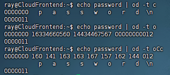

> od -t oCc(C显示字符格式character，显示每个字节对应的ASCII字符，或者使用八进制转义字符，它同时提供了八进制数和字符格式)


**touch(修改文件时间或者创建新文件)**：
- **modification time(mtime)**：
数据内容发生改变
- **status time(ctime)**：
文件权限或者属性被更改
- **access time(atime)**：
文件内容被读取(例如用cat读取)

可以使用**ls**中**time**的参数查看：


touch常用参数：


> touch -d或者-t只会修改mtime和atime，ctime不会被改变

**chattr(修改文件隐藏属性)**：

常用参数：
__+__：增加某一个特殊参数，其他原本存在参数则不动。
__-__：移除某一个特殊参数，其他原本存在参数则不动。
__=__： 设置一定，且仅有后面接的参数。

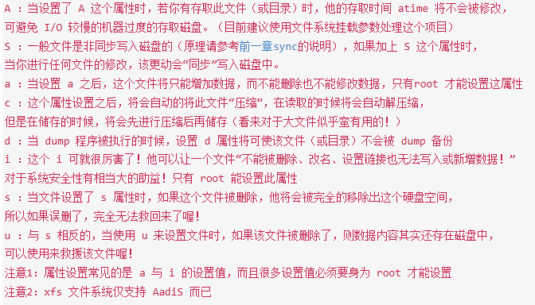

例子：
```Shell
#加i的隐藏属性后，可以看到，sudo也无法删除
ray@CloudFrontend:/tmp$ sudo chattr +i test
ray@CloudFrontend:/tmp$ rm test
rm: cannot remove 'test': Operation not permitted
ray@CloudFrontend:/tmp$ sudo rm test
rm: cannot remove 'test': Operation not permitted
#去掉i属性
ray@CloudFrontend:/tmp$ sudo chattr -i test
```

**lsattr(显示文件隐藏属性)**：

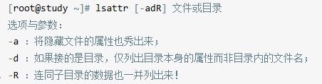

```Shell
# 直接使用lsattr filename
ray@CloudFrontend:/tmp$ lsattr test
--S-ia--------e------- test
```

#### 文件特殊权限： SUID, SGID, SBIT
- Set UID:
当s这个标志出现在文件拥有者x权限上：