## 文件内容查阅
- **cat(concatenate)**：

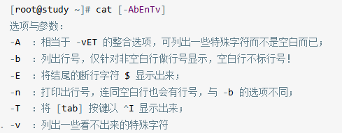

- **tac(反向cat)**

- **nl(添加行号打印)**：

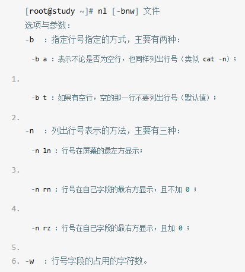

实际例子：

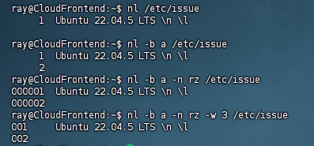

**less(一页一页翻动)**：

常用方法：

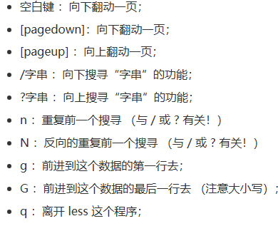

> man page其实就是调用了less指令来说明文档

**head(取出前面几行)**：

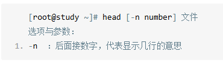

> 默认是显示10行，如果参数是'-n -100'，则表明不包含最后的100行

**tail(取出后面几行)**：

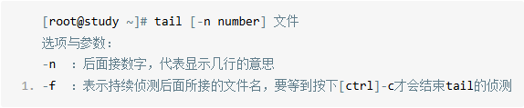

> 默认显示是后面十行，如果参数是'-n +100'，则表明不报行开头的100行

**管道'|'的用法**：
> 比如我需要显示/etc/man的第11到第20行

```Shell
head -n 20 /etc/man | tail -n 10
```
使用head取出前20行，但不显示，而是交给tail取前20行中的后10行并且显示

> 如果我还想显示行数呢？

```Shell
cat -n /etc/man |head -n 20|tail -n 10
```

**od(查看非纯文本文件)**：

常用方法：

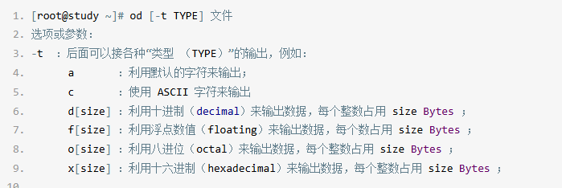

例子：

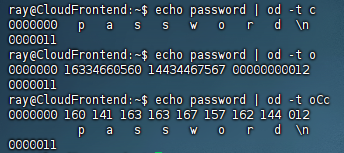

> od -t oCc(C显示字符格式character，显示每个字节对应的ASCII字符，或者使用八进制转义字符，它同时提供了八进制数和字符格式)


**touch(修改文件时间或者创建新文件)**：
- **modification time(mtime)**：
数据内容发生改变
- **status time(ctime)**：
文件权限或者属性被更改
- **access time(atime)**：
文件内容被读取(例如用cat读取)

可以使用**ls**中**time**的参数查看：

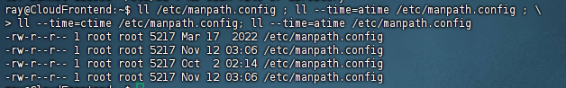

touch常用参数：

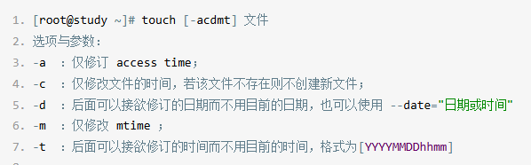

> touch -d或者-t只会修改mtime和atime，ctime不会被改变

**chattr(修改文件隐藏属性)**：

常用参数：
__+__：增加某一个特殊参数，其他原本存在参数则不动。
__-__：移除某一个特殊参数，其他原本存在参数则不动。
__=__： 设置一定，且仅有后面接的参数。

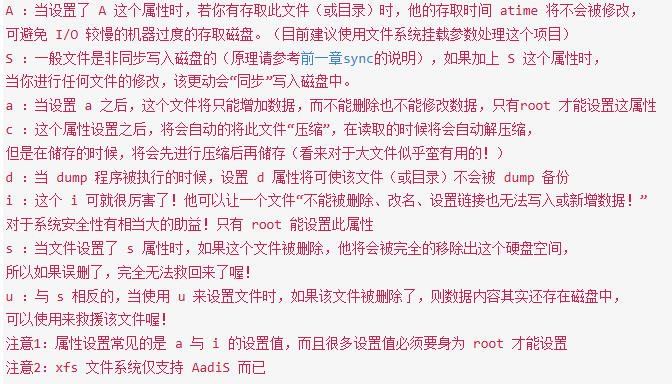

例子：
```Shell
#加i的隐藏属性后，可以看到，sudo也无法删除
ray@CloudFrontend:/tmp$ sudo chattr +i test
ray@CloudFrontend:/tmp$ rm test
rm: cannot remove 'test': Operation not permitted
ray@CloudFrontend:/tmp$ sudo rm test
rm: cannot remove 'test': Operation not permitted
#去掉i属性
ray@CloudFrontend:/tmp$ sudo chattr -i test
```

**lsattr(显示文件隐藏属性)**：

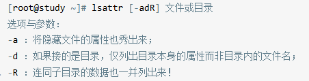

```Shell
# 直接使用lsattr filename
ray@CloudFrontend:/tmp$ lsattr test
--S-ia--------e------- test
```

#### 文件特殊权限： SUID, SGID, SBIT
- Set UID:
```Shell:
ray@CloudFrontend:~$ ll /usr/bin/passwd
#可以看到在owner权限中，x变成了s，这就是set UID
-rwsr-xr-x 1 root root 59976 Feb  6  2024 /usr/bin/passwd*
```
1. 针对二级制程序文件有效，并且仅对程序执行过程中有效(run-time)
2. 当前用户至少有x权限
3. 执行文件的用户则会短暂地成为root用户

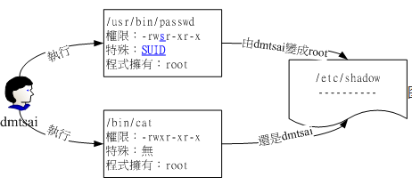

- Set GID:
```Shell:
[root@study ~]# ls -l /usr/bin/locate
#可以看到在group权限中，x变成了s，这就是set GID
-rwx--s--x. 1 root slocate 40496 Jun 10  2014 /usr/bin/locate
```
> 与 SUID 不同的是，SGID 可以针对文件或目录来设置

1. 针对文件：
    1. 仅对二进制程序有效
    2. 执行者需要有x权限
    3. 执行者在执行过程中会获得该程序群组支持
2. 针对目录：
    1. 使用者需要对目录有r与x的权限，该使用者能够进入此目录
    2. 使用者在此目录下的有效群组(effective group)会变成改目录的群组；

- Sticky Bit
```Shell:
# 结尾有一个t
drwxrwxrwt  11 root root  4096 Nov 13 01:57 tmp/
```
1. 只针对目录
2. 使用者对于此目录具有w，x的权限
3. 使用者创建出来的文件只能被root和文件/目录创建者删除/更名/移动等操作。

**如何设置SUID，SGID和SBIT**：
- 4为SUID
- 2为SGID
- 1为SBIT
只需在数字前面加一个这个数字，例如：
```Shell:
[root@study ~]# cd /tmp
[root@study tmp]# touch test                  &lt;==创建一个测试用空档
[root@study tmp]# chmod 4755 test; ls -l test &lt;==加入具有 SUID 的权限
-rwsr-xr-x 1 root root 0 Jun 16 02:53 test
[root@study tmp]# chmod 6755 test; ls -l test &lt;==加入具有 SUID/SGID 的权限
-rwsr-sr-x 1 root root 0 Jun 16 02:53 test
[root@study tmp]# chmod 1755 test; ls -l test &lt;==加入 SBIT 的功能！
-rwxr-xr-t 1 root root 0 Jun 16 02:53 test
[root@study tmp]# chmod 7666 test; ls -l test &lt;==具有空的 SUID/SGID 权限
-rwSrwSrwT 1 root root 0 Jun 16 02:53 test
```
或者使用符号法：
```Shell:
# 设置权限成为 -rws--x--x 的模样：
[root@study tmp]# chmod u=rwxs,go=x test; ls -l test
-rws--x--x 1 root root 0 Jun 16 02:53 test
# 承上，加上 SGID 与 SBIT 在上述的文件权限中！
[root@study tmp]# chmod g+s,o+t test; ls -l test
-rws--s--t 1 root root 0 Jun 16 02:53 test
```

- **file(观察文件类型)**:
例子:
```Shell:
[root@study ~]# file ~/.bashrc
/root/.bashrc: ASCII text  &lt;==告诉我们是 ASCII 的纯文本文件啊！
[root@study ~]# file /usr/bin/passwd
/usr/bin/passwd: setuid ELF 64-bit LSB shared object, x86-64, version 1 （SYSV）, dynamically
linked （uses shared libs）, for GNU/Linux 2.6.32,
BuildID[sha1]=0xbf35571e607e317bf107b9bcf65199988d0ed5ab, stripped
# 可执行文件的数据可就多的不得了！包括这个文件的 suid 权限、相容于 Intel x86-64 等级的硬件平台
# 使用的是 Linux 核心 2.6.32 的动态函数库链接等等。
[root@study ~]# file /var/lib/mlocate/mlocate.db
/var/lib/mlocate/mlocate.db: data  &lt;== 这是 data 文件！
```