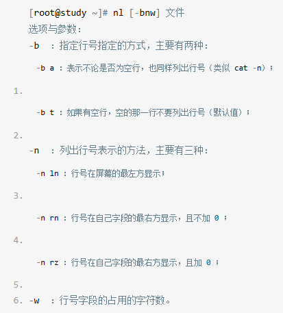

#### 目录的相关操作

__特殊的目录__：

__cd用法例子__：

__pwd用法例子__：

**pwd -P**：会显示一个**链接文件的正确完整路径**

__mkdir用法例子__：

**mkdir -p**：会帮你自行创建多层不存在的目录

**mkdir -m**：会强制设置权限，否则会使用umask默认权限

__rmdir用法例子__：

**rmdir -P**：可以删除多个目录
> rmdir只能删除空的目录(empty directory)

#### 可执行文件路径的变量：$PATH

> 查看当前PATH(环境变量)： echo $PATH

1. 当你使用一个指令的时候，系统会依照PATH的设置去每个PATH定义的目录去搜索该指令的可执行文件
2. 不同身份使用者默认的PATH不同，默认能够执行的指令也不同
3. PATH是可以修改的
4. 可以使用绝对路径或相对路径指定某个指令的文件名来执行
5. 本目录(.)最好不要放到PATH当中

#### 文件与目录的检视
- __ls__ 常用选项：

    

- __cp__ 常用选项：

    
    
- __rm__ 常用选项：

    

> 取得路径的文件名： basename /etc/sysconfig/network
output: network

> 取得路径的目录名： dirname /etc/sysconfig/network
output: /etc/sysconfig

#### 文件内容查阅
- **cat(concatenate)**：

- **tac(反向cat)**

- **nl(添加行号打印)**：

实际例子：

**less(一页一页翻动)**：

常用方法：

