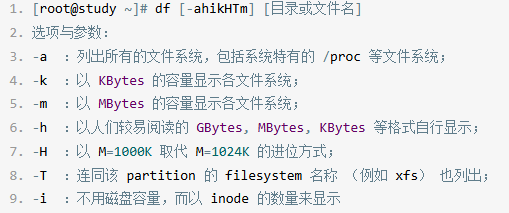
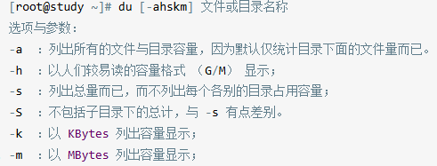

#### 磁盘与目录的容量
##### df：列出文件系统的整体磁盘使用量

**使用方法**：



```shell
#df直接列出文件系统的整体磁盘使用量
ray@CloudFrontend:~$ df
Filesystem     1K-blocks    Used Available Use% Mounted on
/dev/root       30298176 7528372  22753420  25% /
tmpfs            2002960       0   2002960   0% /dev/shm
tmpfs             801188    1148    800040   1% /run
tmpfs               5120       0      5120   0% /run/lock
efivarfs          131072      10    131058   1% /sys/firmware/efi/efivars
/dev/sda15        106832    6190    100642   6% /boot/efi
tmpfs             400592       4    400588   1% /run/user/1000
```

```Shell
#df -h转换成更容易理解的单位(G)
ray@CloudFrontend:~$ df -h
Filesystem      Size  Used Avail Use% Mounted on
/dev/root        29G  7.2G   22G  25% /
tmpfs           2.0G     0  2.0G   0% /dev/shm
tmpfs           783M  1.2M  782M   1% /run
tmpfs           5.0M     0  5.0M   0% /run/lock
efivarfs        128M  9.6K  128M   1% /sys/firmware/efi/efivars
/dev/sda15      105M  6.1M   99M   6% /boot/efi
tmpfs           392M  4.0K  392M   1% /run/user/1000
```

```Shell
#df -i查看可用的inode记录
ray@CloudFrontend:~$ df -ih
Filesystem     Inodes IUsed IFree IUse% Mounted on
/dev/root        3.7M  164K  3.6M    5% /
tmpfs            490K     1  490K    1% /dev/shm
tmpfs            800K   752  800K    1% /run
tmpfs            490K     3  490K    1% /run/lock
efivarfs            0     0     0     - /sys/firmware/efi/efivars
/dev/sda15          0     0     0     - /boot/efi
tmpfs             98K    25   98K    1% /run/user/1000
```

```Shell
#df -a 列出所有的文件系统，包括一些特殊的
#df -T 连同该partition的filesystem名称(例如xfs)也列出
ray@CloudFrontend:~$ df -aT
Filesystem     Type        1K-blocks    Used Available Use% Mounted on
/dev/root      ext4         30298176 7528568  22753224  25% /
devtmpfs       devtmpfs      2000176       0   2000176   0% /dev
proc           proc                0       0         0    - /proc
sysfs          sysfs               0       0         0    - /sys
securityfs     securityfs          0       0         0    - /sys/kernel/security
```

#### du：评估文件系统的磁盘使用量(常用在推估目录所占容量)

**使用方法**：



```Shell
# 默认列出当前目录下所有的文件大小
ray@CloudFrontend:~$ du
4       ./.local/share/nano
8       ./.local/share
12      ./.local
8       ./Xboard/.docker/etc/supervisor
```

```Shell
# du -m 以MBytes显示容量(默认是KBytes)
ray@CloudFrontend:~$ du -m
1       ./.local/share/nano
1       ./.local/share
1       ./.local
1       ./Xboard/.docker/etc/supervisor
1       ./Xboard/.docker/etc/nginx/http.d
1       ./Xboard/.docker/etc/nginx
```

```Shell
# du -sm /* (s仅显示目录)检查目录下哪个此目录占用量
ray@CloudFrontend:~$ du -sm ./*
5       ./Xboard
1       ./srv
1       ./test1
```
