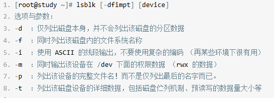
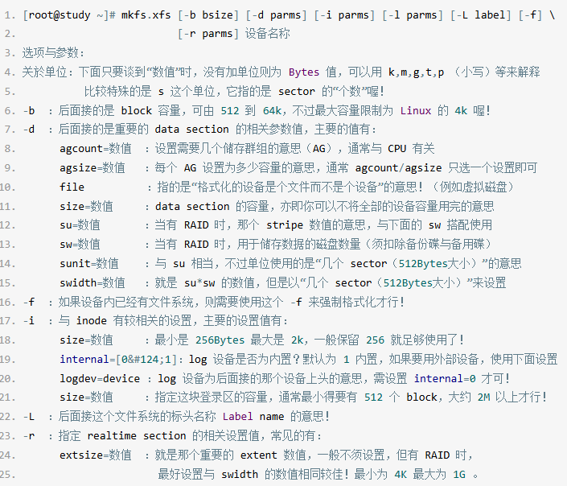
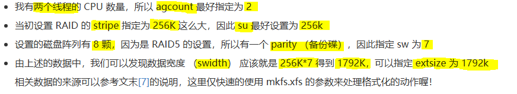
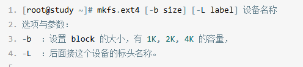

#### 观察磁盘分区指令
##### lsblk(list block device列出系统上所有的磁盘列表)



*使用例子*：

```Shell
ray@CloudFrontend:/tmp$ lsblk
NAME    MAJ:MIN RM  SIZE RO TYPE MOUNTPOINTS
loop0     7:0    0   64M  1 loop /snap/core20/2379
loop1     7:1    0 63.7M  1 loop /snap/core20/2434
loop2     7:2    0   87M  1 loop /snap/lxd/29351
loop3     7:3    0 38.8M  1 loop /snap/snapd/21759
sda       8:0    0   30G  0 disk 
├─sda1    8:1    0 29.9G  0 part /
├─sda14   8:14   0    4M  0 part 
└─sda15   8:15   0  106M  0 part /boot/efi

```
##### blkid(block device attributes查看目前系统有被格式化的设备)

*使用例子*：

```Shell
ray@CloudFrontend:/tmp$ blkid
/dev/sda15: LABEL_FATBOOT="UEFI" LABEL="UEFI" UUID="C83D-C1E5" BLOCK_SIZE="512" TYPE="vfat" PARTUUID="5a96d93f-d978-48a9-8a28-777e93049518"
/dev/sda1: LABEL="cloudimg-rootfs" UUID="0b58668a-ba2e-4a00-b89a-3354b7a547d4" BLOCK_SIZE="4096" TYPE="ext4" PARTUUID="5123f679-d605-4389-a23d-2369218cc1a5"
/dev/loop1: TYPE="squashfs"
/dev/loop2: TYPE="squashfs"
/dev/loop0: TYPE="squashfs"
/dev/loop3: TYPE="squashfs"
```

##### parted(列出磁盘的分区表类型与分区信息)

**使用方法**：

parted device_name print

*使用例子*：

```Shell
ray@CloudFrontend:/tmp$ sudo parted /dev/sda print
Model: Msft Virtual Disk (scsi)
Disk /dev/sda: 32.2GB
Sector size (logical/physical): 512B/4096B
Partition Table: gpt
Disk Flags: 

Number  Start   End     Size    File system  Name  Flags
14      1049kB  5243kB  4194kB                     bios_grub
15      5243kB  116MB   111MB   fat32              boot, esp
 1      116MB   32.2GB  32.1GB  ext4
```

##### 磁盘分区命令

- **fdisk(针对MBR)**

- **gdisk(针对GPT)**：

*使用方法*：
```Shell
ray@HongKongVPS:~$ sudo gdisk /dev/sda
GPT fdisk (gdisk) version 1.0.10

Partition table scan:
  MBR: protective
  BSD: not present
  APM: not present
  GPT: present

Found valid GPT with protective MBR; using GPT.

Command (? for help):
```

##### 磁盘格式化(创建XFS文件系统)
- **mkfs.xfs(make xfs filesystem)**：

*使用方法*：



- **XFS文件系统for RAID性能优化(Optional)**：
> RAID简单来说就是磁盘列阵，多颗磁盘组成一个大磁盘

- RAID会将**文件**细分成数个**小型分区区块(stripe)**
    - 数值大多介于4k到1M之间

*使用范例*：



```Shell
[root@study ~]# mkfs.xfs -f -d agcount=2,su=256k,sw=7 -r extsize=1792k /dev/vda4

meta-data=/dev/vda4              isize=256    agcount=2, agsize=131072 blks
         =                       sectsz=512   attr=2, projid32bit=1
         =                       crc=0        finobt=0
data     =                       bsize=4096   blocks=262144, imaxpct=25
         =                       sunit=64     swidth=448 blks
naming   =version 2              bsize=4096   ascii-ci=0 ftype=0
log      =internal log           bsize=4096   blocks=2560, version=2
         =                       sectsz=512   sunit=64 blks, lazy-count=1
realtime =none                   extsz=1835008 blocks=0, rtextents=0
```

> sunit = 256K(stripe size)/4k(block size) = 64(block)
> swidth = 1792K(swidth size)/4k(block size) = 448(block)
##### 磁盘格式化(创建EXT4文件系统)
- **mkfs.ext4(make ext4 filesystem)**：

*使用方法*：




*使用范例*：
```Shell
范例：将 /dev/vda5 格式化为 ext4 文件系统
[root@study ~]# mkfs.ext4 /dev/vda5
mke2fs 1.42.9 （28-Dec-2013）
Filesystem label=                                  # 显示 Label name
OS type: Linux
Block size=4096 （log=2）                            # 每一个 block 的大小
Fragment size=4096 （log=2）
Stride=0 blocks, Stripe width=0 blocks             # 跟 RAID 相关性较高
65536 inodes, 262144 blocks                        # 总计 inode/block 的数量
13107 blocks （5.00%） reserved for the super user
First data block=0
Maximum filesystem blocks=268435456
8 block groups                                     # 共有 8 个 block groups 喔！
32768 blocks per group, 32768 fragments per group
8192 inodes per group
Superblock backups stored on blocks:
        32768, 98304, 163840, 229376
Allocating group tables: done
Writing inode tables: done
Creating journal （8192 blocks）: done
Writing superblocks and filesystem accounting information: done
```

