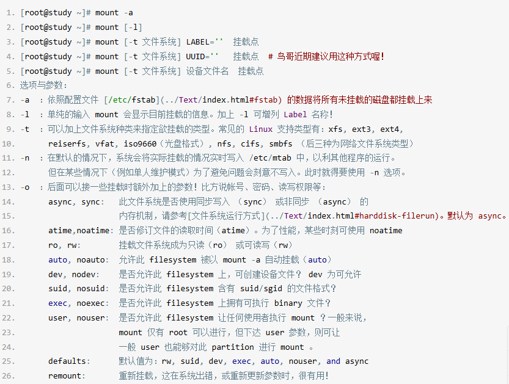
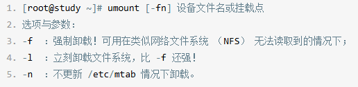
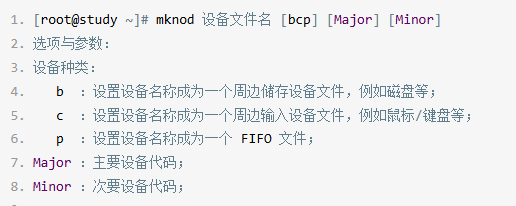
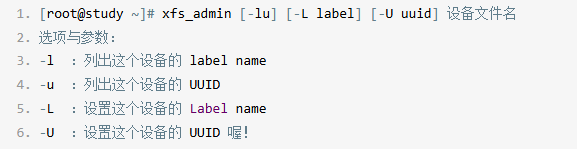
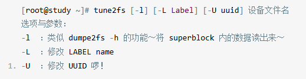

#### 文件系统挂载
*一些考虑事项*：
- **单一文件系统不**应该被重复挂载在**不同挂载点**(目录)中
- **单一目录不**应该重复挂载在**多个文件系统**
- 作为挂载点的目录，里应该是空目录，不然挂载后，只会显示**新文件系统里的数据**，**原先文件系统**关于此挂载点的**数据将被隐藏**(unmount了新文件系统后会重新显现)

- **mount**：

*使用方法*：



> -t 这个选项已经不太需要了，系统会自动分析最恰当的文件系统来尝试挂载你的设备
> - **/etc/filesystems**: 系统指定的测试挂载文件系统类型的优先顺序
> - **/proc/filesystems**: Linux系统已经载入的文件系统类型
> - **/lib/modules/\$(uname -r)/kernel/fs/**：Linux支持的文件系统之驱动程序，例如ext4
的驱动程序就写在 **"/lib/modules/\$（uname -r）/kernel/fs/ext4/"**

*使用范例*：
```Shell
[root@study ~]# mount UUID="e0a6af55-26e7-4cb7-a515-826a8bd29e90" /data/xfs
```

```Shell
# 将/重新挂载，并加入参数为rw与auto
[root@study ~]# mount -o remount,rw,auto /
```

- **umount**：

*使用方法*：



- **mknod(make node修改设备major与minor数值)**：



```Shell
#查看设备major和minor码
ray@HongKongVPS:~$ ll /dev/sda*
brw-rw---- 1 root disk   8,  0 Nov 20 02:44 /dev/sda
brw-rw---- 1 root disk   8,  1 Nov 20 02:44 /dev/sda1
brw-rw---- 1 root disk   8, 14 Nov 20 02:44 /dev/sda14
brw-rw---- 1 root disk   8, 15 Nov 20 02:44 /dev/sda15
brw-rw---- 1 root disk 259,  0 Nov 20 02:44 /dev/sda16

#增加sda11的major和minor码
ray@HongKongVPS:~$ sudo mknod /dev/sda11 b 8 11
ray@HongKongVPS:~$ ll /dev/sda*
brw-rw---- 1 root disk   8,  0 Nov 20 02:44 /dev/sda
brw-rw---- 1 root disk   8,  1 Nov 20 02:44 /dev/sda1
brw-r--r-- 1 root root   8, 11 Nov 20 07:09 /dev/sda11
brw-rw---- 1 root disk   8, 14 Nov 20 02:44 /dev/sda14
brw-rw---- 1 root disk   8, 15 Nov 20 02:44 /dev/sda15
brw-rw---- 1 root disk 259,  0 Nov 20 02:44 /dev/sda16
```

- **xfs_admin(修改XFS文件系统的UUID与Lable name)**：
> 格式化的时候忘记加上标头名称，使用此命令修改

*使用方法*：



- **tune2fs(修改ext4的UUID与label name)**：

