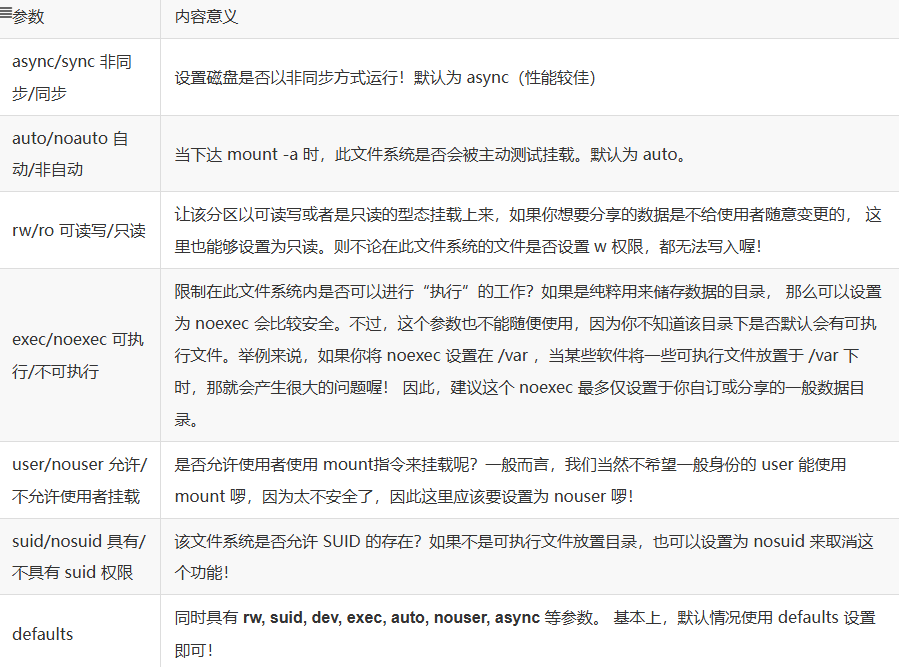

#### 开机挂载 /etc/fstab及 /etc/mtab
- **/etc/fstab(filesystem table)**：
> 就是利用mount指令进行挂载

```Shell
#文件内容
# CLOUD_IMG: This file was created/modified by the Cloud Image build process
# [设备/UUID等]  [挂载点]  [文件系统]  [文件系统参数]   [dump]  [fsck]
UUID=bf171e20-4158-4861-8c95-1443ece8c413       /        ext4   discard,commit=30,errors=remount-ro           0 1
LABEL=BOOT      /boot   ext4    defaults,discard        0 2
UUID=D5E6-8187  /boot/efi       vfat    umask=0077      0 1
```

讲解其中参数：
```Shell
[设备/UUID等]  [挂载点]  [文件系统]  [文件系统参数]  [dump]  [fsck]
```
1. 第一栏： 
    - 文件系统或磁盘**设备文件名**，如/dev/sda
    - 文件系统的**UUID**
    - 文件系统的**LABEL**名称
2. 第二栏(mount point)：目录
3. 第三栏(file system):磁盘分区的文件系统
4. **第四栏(文件系统参数)**：



5. 第五栏：能否被dump备份指令作用(现在有太多备份方案了，这个项目直接输入0即可)

6. 第六栏(是否以dsck检查扇区)：通过fsck去检查本机的文件系统，看看是否clean。(xfs可以自己进行检验，填0即可)

> 如果开机时/etc/fstab输入的数据有误，导致无法顺利开机，而进入单人维护模式，此时/时read only的状态，也无法修改/etc/fstab，也无法更新/etc/mtab，则跑以下命令：
```Shell
[root@study ~]# mount -n -o remount,rw /
```

