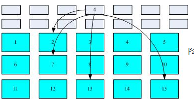
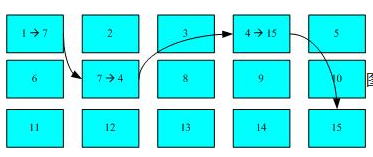
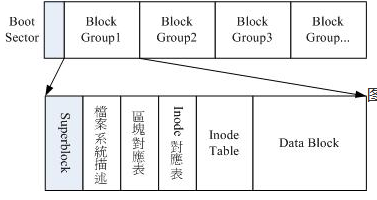
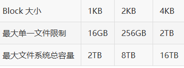
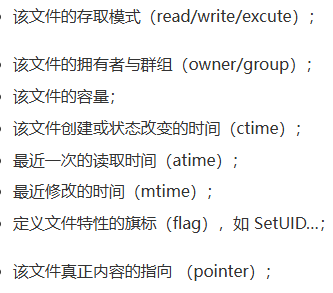
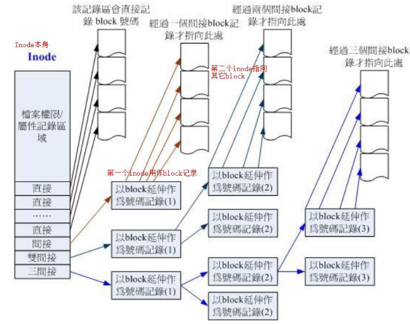

### 文件系统
> 磁盘分区完毕后需要进行格式化之后操作系统才能将支持的文件系统存放到分区中。

##### linux文件系统中的组成部分：
- __superblock__：
    - 记录包括**inode/block**的总量、使用量、剩余量
    - 文件系统的格式和相关信息等。

- __inode__：
记录文件的属性，一个文件占用**一个inode**，同时记录文件数据所在的**block号码**。

- __block__：
**实际文件的内容**，若文件太大，会占用多个block。

*示意图*：

> - 灰色是文件inode号码，指向文件数据存放的block号码
> - 这种方式叫做**索引文件系统(indexed allocation)**

*其他文件系统比如U盘示意图*：

> **FAT格式**(没有inode的存在)
> 需要读取一个block才知道下一个block的位置
> 如果文件数据分散的过于厉害，磁盘要多转很多圈才能读取完

##### Ext2文件系统：
*Ext2格式化后示意图*：

- **boot sector(开机扇区)**：
    - 开机扇区可以安装开机管理程序

- **data block(数据区块)**：
    - Ext2文件系统所支持的block大小有1K,2K及4K(**只能选一种**)，在格式化后就固定了。
    - 由于block大小差异，导致该文件系统支持的最大磁盘容量和单一文件大小并不相同：

        
        
        - 一个block只能存放一个文件
        - 如果**文件大于block**，则需要占用多个block，反之，**文件小于block*，则剩余容量会浪费

- **inode table**：
    - 记录文件属性以及文件实际数据放在几号block
    - 记录的文件属性有如下：

         

    - 每个inode大小**固定为128 Bytes**(新的ext4和xfs可设置成256 Bytes)
    - 每个文件仅**占用一个inode**
    - inode结构图：

        

    

