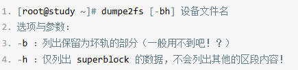
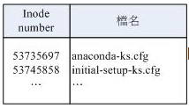
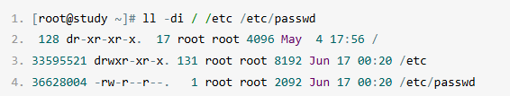

### 文件系统
> 磁盘分区完毕后需要进行格式化之后操作系统才能将支持的文件系统存放到分区中。

##### linux文件系统中的组成部分：
- __superblock__：
    - 记录包括**inode/block**的总量、使用量、剩余量
    - 文件系统的格式和相关信息等。

- __inode__：
记录文件的属性，一个文件占用**一个inode**，同时记录文件数据所在的**block号码**。

- __block__：
**实际文件的内容**，若文件太大，会占用多个block。

*示意图*：


> - 灰色是文件inode号码，指向文件数据存放的block号码
> - 这种方式叫做**索引文件系统(indexed allocation)**


*其他文件系统比如U盘示意图*：


> **FAT格式**(没有inode的存在)
> 需要读取一个block才知道下一个block的位置
> 如果文件数据分散的过于厉害，磁盘要多转很多圈才能读取完


##### Ext2文件系统：
*Ext2格式化后示意图*：


- **boot sector(开机扇区)**：
    - 开机扇区可以安装开机管理程序

- **data block(数据区块)**：
    - Ext2文件系统所支持的block大小有1K,2K及4K(**只能选一种**)，在格式化后就固定了。
    - 由于block大小差异，导致该文件系统支持的最大磁盘容量和单一文件大小并不相同：

        
        
        - 一个block只能存放一个文件
        - 如果**文件大于block**，则需要占用多个block，反之，**文件小于block**，则剩余容量会浪费

- **inode table**：
    - 记录文件属性以及文件实际数据放在几号block
    - 记录的文件属性有如下：

         

    - 每个inode大小**固定为128 Bytes**(新的ext4和xfs可设置成256 Bytes)
    - 每个文件仅**占用一个inode**
    - inode结构图：

        

    
- **superblock(超级区块)**：
    - block与inode的总量；
    - 未使用和已使用的inode/block的数量；
    - block与inode的大小；
    - filesystem的挂载时间、最近一次写入数据的时间、最近一次检验磁盘(fsck)的时间等文件系统的相关信息；
    - valid bit数值：如果文件系统已被挂载，则为0，未被挂载，则为1；
> superblock非常重要，文件系统的基本信息都在里面，默认大小为1024Bytes。
> 此外，默认来说只有第一个block group含有superblock，但后续的block group也可能会含有superblock，作为backup

- **Filesystem Description(文件系统描述说明)**:
    - 区段描述每个block group的开始与结束的block号码。

- **block bitmap(区块对照表)**：
    - 记录哪些block是空的，帮助系统快速找到闲置空间来存放文件

- **inode bitmap(inode对照表)**：
    - 记录哪些inode是没有使用过的

-**blkid**(查看目前系统有被格式化的设备)：

*使用例子：*
```shell
ray@CloudFrontend:~$ blkid
/dev/sda15: LABEL_FATBOOT="UEFI" LABEL="UEFI" UUID="C83D-C1E5" BLOCK_SIZE="512" TYPE="vfat" PARTUUID="5a96d93f-d978-48a9-8a28-777e93049518"
/dev/sda1: LABEL="cloudimg-rootfs" UUID="0b58668a-ba2e-4a00-b89a-3354b7a547d4" BLOCK_SIZE="4096" TYPE="ext4" PARTUUID="5123f679-d605-4389-a23d-2369218cc1a5"
/dev/loop1: TYPE="squashfs"
/dev/loop2: TYPE="squashfs"
/dev/loop0: TYPE="squashfs"
/dev/loop3: TYPE="squashfs"
```

- **dumpe2fs**(查询Ext家族superblock信息)：

*使用方法*：



##### 目录数

- **目录**：
    - 文件系统会分配一个inode与至少一块block给该目录
    - inode记录改目录的相关权限与属性，以及block号码
    - block则是记录在这个目录下的文件名与该文件名占用的inode号码如下：

        
    

- **文件**：
    - 文件系统会分配一个inode与匹配文件大小的block数量
        > 例如文件时100 KBytes，那么则会分配25个block(因为inode只有12个直接指向，所以要多一个block作为区块号码的记录)

- **目录树读取**：
    > 要读取某个文件时，务必会经过目录的inode与block，才能找到文件的inode号码，最终能够读取正确文件的block内的内容
    ##### 读取/etc/passwd的过程：

    

        
    ###### 先找到 **/** 的inode：
    通过挂载点的信息找到inode号码为128的根目录，且我们**具备根目录r**的权限，所以可以读取**根目录block的内容**
    ###### 再找到 **/etc** 的inode：
    通过读取根目录的block，我们得到 **/etc** 的inode
    ###### 再读取 **/etc** 的block：
    由于我们具有 **/** 的 **x**权限，所以我们能进入该目录继续读取目录下的内容， 对 **/etc** 有 **r** 权限，所以可以进一步读取 **/etc** 的block
    ###### 再找到 **/etc/passwd** 的inode：
    通过读取 **/etc** 的block，得到 **/etc/passwd** 的inode
    ###### 再读取 **/etc/passwd** 的block：
    由于我们具备 **/etc** 的**x**权限，所以我们能进入该目录继续读取目录下的内容， 对 **/etc/passwd** 有 **r** 权限，所以可以进一步读取 **/etc** 的block

