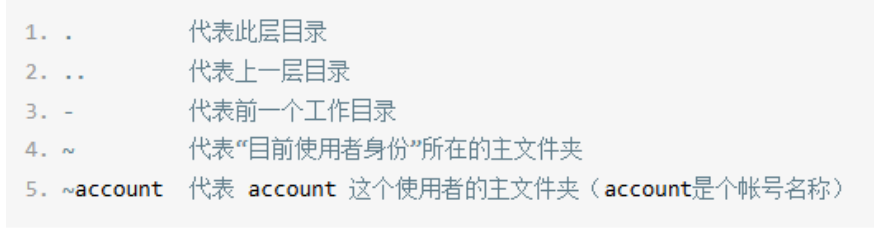
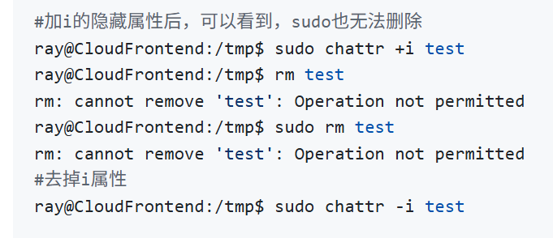
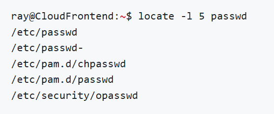

1. **grep**: sudo demsg | **grep -n -A3 -B3 'memory range'** (显示匹配行数的前后三行并显示行数)
2. **sed**: nl /etc/passwd | **sed '2,5d'** (删除2-5行) 或 | **sed '2i drink tea'** (第二行插入单词) 或 | **sed '2,5c No 2-5 number'** (将2-5行替代成其他文本) 或 | **sed -n '5,7p'** (只显示5-7行) 或 | **sed 's/正则表达式/替代文本/g'** (将特定文本替换成指定文本再显示)

3. **awk**：

    - last -n 5 | awk '{print $1 "\t" $3}'(显示第一栏变量，制表符然后第三栏变量)
    - last -n 5 | awk '{print $1 "\t lines: " NR "\t columns: " NF}'(显示第一栏变量，制表符接lines:，然后显示NR当前是第几行，然后接制表符加columns:，然后加NF显示当前行数的字段总数)
    - awk -F ':' '$3 < 10 {print $1 "\t" $3}' /etc/passwd(指定分隔符为':'，并且只选择行数的第三栏变量小于10的行数，具体显示方式依据{action}中的动作)

5. type: 检查指令是否来源于bash

6. env:直接使用，查看环境变量

7. set:直接使用，查看环境变量和自定变量

8. export: 将自定变量变成环境变量

9. read:read -p "what is your name: " -t 30 mynam

10. declare: declare -i sum=100+300+200(将sum定义成整数)或 declare -x(将变变成环境变量) 或 declare -r(将变量变成只读，如果改成加号，比如+x,+r就是将变量变回自定变量或者可读变量)或 declare -p(显示变量的属性)

11. array: var=(1 2 3), 查看向量中所有的值：echo ${var[@]}，查看特定的值(比如第一个值)：echo ${var[0]} 

12. ulimit: ulimit -a(列出所有限制)，修改：ulimit -f 10240(仅允许创建10Bytes以下的容量文件)

13. unix2dos & dos2unix: unix2dos -k man_db.conf(将/etc/man_db.conf转换成dos断行并保留原本的mtime) 或 dos2unix -k -n man_db.conf man_db.conf.linux(将/etc/man_db.conf转换成Linux断行符并保留旧文件)

14. iconv: iconv -f big5 -t utf8 vi.big5 -o vi.utf8(将/tmp/vitest/vi.big5 转成 utf8 编码并存到新的文件vi.utf8中)

15. gzip,bzip2,xz:
    - 压缩文件：gzip -v filename(-k 会保留源文件)
    - 查看压缩文件：zcat filename
    - 解压缩文件：gzip -d filename
    - 查询压缩文件：zgrep -n 'keyword' filename(-n 显示行数)
    - 查看压缩比例：gzip -l filname

16.tar:
    - 压缩：tar -j**c**v filename.tar.bz2 /etc
    - 查询：tar -j**t**v filename.tar.bz2
    - 解压缩：tar -jxv filename.tar.vz2 -C <解压缩的目标目录>
## 文件，目录相关：
1. cd(切换目录)：

2. pwd(显示当前路径名称)：**pwd -p** 会显示链路文件的完整路径

3. mkdir(创建目录): **mkdir -p test1/test2/test3** 需要创建多层目录则需要-p 

4. touch(修改文件时间或者创建新文件): **touch filename**(创建新文件)

5. ls(目录检查): **ls -l**: 列出文件属性和全选 **ls -a**: 列出所有文件包括隐藏文件 **ls -d**: 仅列出目录

6. cp(copy): **cp -a source file/source dir destination file/destination dir** (-a就包括了-r(递归持续复制目录))

7. rm(remove): **rm -f**(强制删除，忽略不存在的文件，不会出现警告) **rm -r**(递归删除目录)

8. nl(添加行号打印)

9. head(取出前面几行): **head -n 数字 filename**(-n 接数字表明显示几行)

10. tail(取出后面几行): **tail -n 数字 filename**(-n 接数字表明显示几行)

11. **chattr**(change attribute修改文件隐藏属性): **chattr +属性/-属性 filename**

12. **lsattr**(list attribute显示文件隐藏属性): **lsattr filename**

13. which(查找可执行文件): **which filename**

14. locate/updatedb(在数据库中寻找文件名): **locate -l 5 passwd**(-l 表示只查找几次) **-i**(表示忽略大小写)

- locate的数据库每天默认更新一次

- 所以新创建的文件，不会立刻更新到数据库，需要使用updatedb来更新

    - updatedb会读取 **/etc/updatedb.conf** 里面的配置文件，然后去硬盘搜索文件名并且更新数据库

15. **find**(直接在硬盘上查找文件): 
- **find / -name "*.conf"**(用文件名查找,如果是iname则是不分大小写)
- **find . -type f**(按类型查找文件或目录， f代表只找文件，d则是只找目录)
- **find /var -type f -size +100M**(通过文件大小查找，+100M找超过100Mbytes，-1G找低于1Gbytes的)
- **find . -type f -mtime -1**(通过修改时间查找，-mtime -1找一天内修改过的文件。-mtime +1则是1天前修改的)
- **find / -type f -perm -4000**(通过文件权限查找，查找有SUID的文件)
- **find . -type f -empty**(查找空文件/目录)
- 最后接-delete可以直接删除，但是为了安全可以在-delete前加-print看会删除什么文件
- **find . -type f -name ".sh" -exec chmod +x {} \\**(配合exec可以执行命令，把当前目录下所有 .sh 文件都设为可执行)

## 磁盘，文件系统相关：
1. **lsblk**(列出系统上所有的磁盘列表，磁盘拓扑总览)

2. **blkid**(查看目前系统有哪些格式化的设备，查看磁盘UUID，type等信息)

3. **parted**(列出片的分区表信息，也可以用来增加/删除分区): **parted device_name print**(显示分区的方法)， **parted /dev/sda malabel gpt**(将磁盘改成gpt格式)

4. **fdisk**/**gdisk**(磁盘分区命令，f针对MBR，g针对GPT): **fdisk device_name** / **gdisk device _name**

5. **mkfs.xfs/mkfs.ext4**(磁盘格式化)

6. mkswap(创建swap格式文件类型): mkswap /dev/vda6 然后接swapon /dev/vda6 启动

7. xfs_repair(xfs处理文件系统错乱的指令)：xfs /dev/sda1

8. fsck.ext4(fsck是个综合指令，针对ext4就接ext4)

9. dumpe2fs(查看Ext家族superblock信息)

10. xfs_admin(修改XFS文件系统的UUID与label name)

11. tune2fs(修改ext4的UUID与label name)

12. **mount**: mount UUID="XXXX-XXXX" /data/xfs (通过UUID挂载分区到某一个路径mount point) mount -o remount,rw,auto /(将/重新挂载，并加入参数为rw与auto)

13. **unmount:** unmount -f 设备文件名或者挂载点(-f强制卸载)

14. **loop**(是一种虚拟化技术，将文件的内容映射成一块设备)：mount -o loop /tmp/CentOS-7.0-1406-x86_64-DVD.iso /data/centos_dvd

15. mknod(修改设备的major与minor数值)

16. **df**(列出文件系统的整体磁盘使用量): **df -h** 转换成人类理解的单位(G), **df -ih** 查看可用的inode记录， **df -a** 列出所有的文件系统包括一些特殊的, **df -T** 连同partition的filesystem名称例如xfs也列出

17. du(估算目录所占容量): du 默认列出当前目录下所有的文件大小(默认KBytes)， du -m 以MBytes显示容量， du -sm ./* (s仅显示目录)检查当前目录下的所有目录的占用量

18. ln(创建链接的方法): ln -s (默认会创建hard link，-s创建soft link)

## nginx相关
1. sudo nginx -t(检查配置文件是否正确，比如添加了站点、改了反向代理规则等时运行)
2. sudo systemctl reload nginx(不重启nginx，不中断连接，平滑加载新配置)
3. sudo systemctl restart nginx(重启nginx，中断连接)
4. sudo systemctl status nginx(查看nginx运行情况)
6. sudo tail -f /var/log/nginx/error.log(实时查看nginx报错)

## curl相关
1. curl http://example.com(基本访问，发送get到网站)
2. curl -X POST http://example.com(指定请求方法/GET/POST/DELETE/PUT等到网站)
3. curl -H "Content-Type: application/json" -H "Authorization: Bearer TOKEN" http://example.com(携带请求头，多个-H添加多个HTTP头)
4. curl -X POST -H "Content-Type: application/json" -d '{"name":"Tom"}' http://example.com/api(-d 发送请求体数据，配合 Content-Type 说明格式。)
5. curl -o output.html http://example.com（保存响应到文件，-o 指定保存文件名。）
6. curl -L http://example.com(跟随重定向，自动跟随 301/302 重定向。)
7. curl -w "\nTime: %{time_total}s\n" -o /dev/null -s http://example.com(测试接口耗时，只输出总耗时（-o /dev/null 丢弃内容，-s 静默模式））
8. curl -F "file=@/path/to/file.txt" http://example.com/upload(上传文件，-F 用 multipart/form-data 上传文件。)
9. curl --cookie "name=value" http://example.com(模拟浏览器带 Cookie 访问)
10. curl -i http://example.com(-i 会显示响应头 + 响应体, -I 只显示响应头。)

## apt相关

## Docker 常用命令速查表
## docker相关

1. docker ps (查看当前运行中的容器)
2. docker ps -a (查看所有容器，包括已停止的)
3. docker images (查看本地镜像)
4. docker run -it --name mycontainer ubuntu /bin/bash (运行交互式容器，并命名为 mycontainer)
5. docker start mycontainer (启动已停止的容器)
6. docker stop mycontainer (停止运行中的容器)
7. docker restart mycontainer (重启容器)
8. docker rm mycontainer (删除容器)
9. docker rmi myimage (删除镜像)
10. docker exec -it mycontainer /bin/bash (进入正在运行的容器)
11. docker logs -f mycontainer (实时查看容器日志)
12. docker build -t myimage:latest . (在当前目录构建镜像，并命名为 myimage:latest)
13. docker pull nginx:latest (从 Docker Hub 拉取最新的 nginx 镜像)
14. docker push myrepo/myimage:latest (推送镜像到仓库)
15. docker network ls (查看所有 Docker 网络)
16. docker volume ls (查看所有 Docker 卷)
17. docker inspect mycontainer (查看容器详细信息)
18. docker-compose up -d (使用 docker-compose 后台启动服务)
19. docker-compose down (停止并删除由 docker-compose 创建的容器、网络等)
20. docker stats (实时查看容器资源使用情况)

## 网络相关
1. **iptables**：iptables -t \<表格名字> -S(通过**规则语句**打印规则，方便阅读) | grep \<关键词> | head(比如要查看kube-proxy实现端口转发操作的表：sudo iptables -t nat -S | grep 30080 | head)
2. nft list ruleset(list ruleset nft命令的子命令，用于​​列出所有配置的规则集​​。) | grep 30080 -n(显示行号) | head

