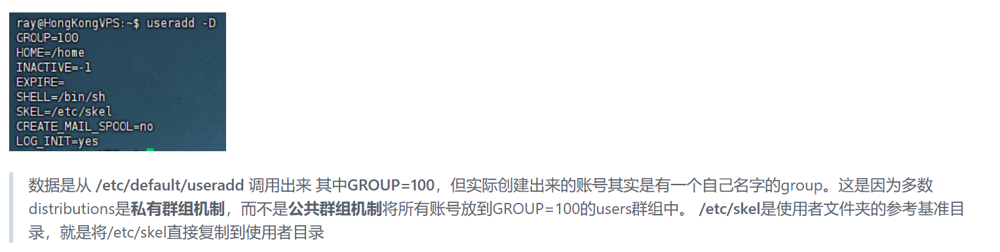
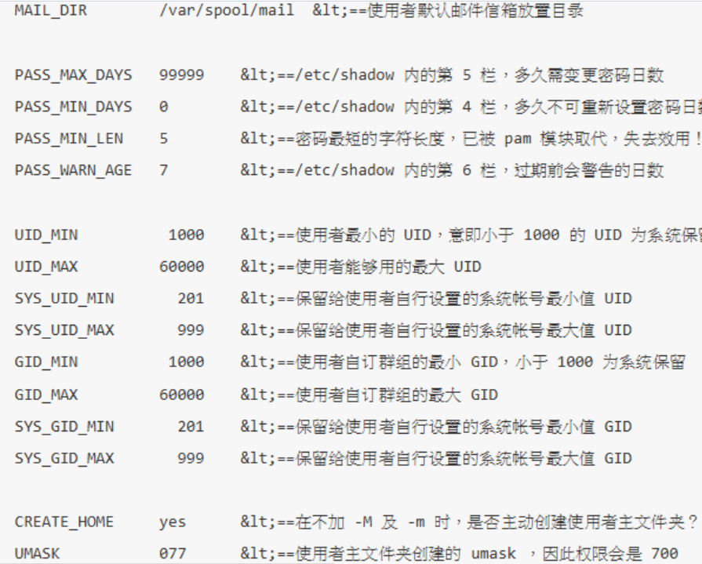

## etc
1. **/etc/passwd** 存储用户账号信息
2. **/etc/shadow** 存储用户账号密码
3. **/etc/group** 存储群组信息
4. **/etc/gshadow** 存储群组密码
5. **/etc/default/useradd** useradd命令的默认参数
6. **/etc/skel** 使用者文件夹的参考基准目录

7. **/etc/login.defs** UID/GID以及密码默认参数

> 当useradd常见账户时，会参考/etc/default/useradd, /etc/skel, /etc/login.defs

8. **/etc/shells** 查看系统上可用的shell，通过chsh -l也可以调用
9. **/etc/sudoers** 只有在此文件内规范的用户才能执行sudo命令
10. **/etc/nologin.txt** 尝试登陆nologin的账户时会返回的信息存在此文件
11. **/etc/pam.d** pam模板存储文件夹 **/etc/security/limits.conf** PAM管理的一些系统限制 **/var/log/secure** PAM报错的log
12. **/etc/init.d/** 早期CentOS以前的版本系统services启动接口是在/etc/init.d/这个项目下，里面都是bash script
13. **/etc/locale.conf**:语系定义的位置
    - **/usr/lib/locale**:存放所有语系文件的位置
    
****:
## dev
1. **/dev/null**:特殊文件，任何写入其中的数据都会被丢弃

## home
1. **~/.bash_history**:存放前一次登录的记录中使用过的命令，这一次的记录暂存在内存中
